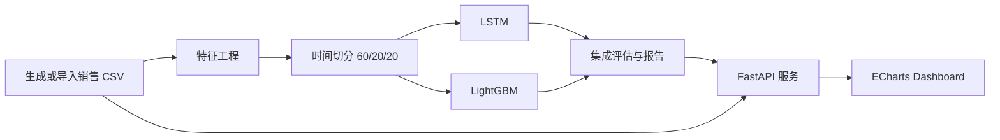

# 销售数据预测与可视化大屏

一个面向零售补货决策的销售预测 MVP。它把“历史销量、未来 30 天预测、ABC 分级和采购建议”串成一条可演示、可测试、可解释的链路，适合用来展示数据分析、机器学习和全栈工程能力。

> **项目定位**：这是一个使用生成数据的面试演示项目，不是已经接入真实 ERP/WMS 的生产系统。文档会明确区分已验证能力和后续生产化工作。

当前状态与未完成任务见 [`CONTEXT.md`](CONTEXT.md) 和 [`TODO.md`](TODO.md)；V1 验收结论见 [`docs/releases/v1-acceptance.md`](docs/releases/v1-acceptance.md)。
Local Demo V2 本机验收记录见 [`docs/local-demo-v2-acceptance-2026-09-22.md`](docs/local-demo-v2-acceptance-2026-09-22.md)。

当前正在推进**本地完整演示版 V2**：M1/T1、M1/T2、M2/T3/T4/T5、T6 预测分析、T7 库存试算、T8 本地角色审批和 T9 系统诊断已完成。当前数据中心已支持 CSV 模板、上传预检、行级错误报告下载、候选版本清单、运行快照详情/发布/回滚；模型中心已支持候选模型清单、训练任务状态和兼容激活；预测分析已支持商品/门店下钻、来源版本、历史/未来明细和 CSV 导出；库存决策已支持风险清单、筛选和服务端 what-if 试算；计划中心在显式鉴权模式下已支持分析员提交、审批员批准/驳回、拒绝后修订版、管理员审计和导出；系统页已支持运行版本与质量只读诊断；T3/T5 已通过失败恢复、完整训练版本一致性和训练期间服务稳定性回归；T10 已增加 Windows CI、进程级离线冒烟和 4 核 affinity 性能基线。物理固定 4 核/8GB 和完全断网人工复演仍待最终验收。功能边界、分阶段路线和验收标准见 [`docs/local-demo-plan.md`](docs/local-demo-plan.md)。

本地完整演示版的 Windows 入口已经开始实现：先准备一次隔离演示包，再启动服务。准备阶段可能运行 CPU 模型训练，面试现场直接启动已验证的演示包。

```powershell
python scripts/prepare_demo.py --root .demo-runtime
scripts\start_demo.ps1 -Root .demo-runtime
# 浏览器打开 http://127.0.0.1:3000
scripts\stop_demo.ps1 -Root .demo-runtime
```

如果需要重新生成数据和模型，使用 `python scripts/prepare_demo.py --root .demo-runtime --force`；启动器会检查演示包、端口和服务健康状态，不会默认触发训练。

面试时如需演示角色审批，可显式开启本地鉴权模式。预置账号只用于本地演示，不应作为生产身份方案：

```powershell
scripts\start_demo.ps1 -Root .demo-runtime -WithAuth
# 分析员：analyst / demo-analyst
# 审批员：approver / demo-approver
# 管理员：admin / demo-admin
```

默认不带 `-WithAuth` 时保留本地兼容模式，便于无登录快速浏览；生产部署不会开放预置演示账号。

演示系统页可以切换标准、缺货风险、库存过期、历史不足和导入错误场景，并创建/恢复本地备份或生成脱敏诊断包。也可以直接生成不含数据库、日志、任务和会话的资源包：

```powershell
python scripts/package_demo.py --root .demo-runtime --output .demo-runtime/dist/local-demo.zip
python scripts/verify_offline_demo.py --root .demo-runtime
# 进程级离线运行时冒烟：会阻断后端非本机网络访问，并自动停止服务
scripts\verify_offline_demo.ps1 -Root .demo-runtime
# 追加浏览器业务回归，验证本地服务不依赖外网资源
scripts\verify_offline_demo.ps1 -Root .demo-runtime -RunBrowserE2E
# 真实 worker 失败注入、重试、候选隔离和人工激活回归（仅非生产 smoke 档案）
scripts\verify_offline_demo.ps1 -Root .demo-runtime -RunModelRecoveryE2E
# 普通完整训练期间持续探测健康、模型、商品、库存和元数据接口
scripts\verify_offline_demo.ps1 -Root .demo-runtime -RunModelStabilityE2E
# 普通完整训练后候选激活与总览/数据/预测/库存/系统版本一致性
scripts\verify_offline_demo.ps1 -Root .demo-runtime -RunModelConsistencyE2E
# 鉴权完整业务回放：错误/有效 CSV、预测、补货、审批、场景、备份恢复和诊断
scripts\verify_offline_demo.ps1 -Root .demo-runtime -RunFullReplayE2E
# 4 核 affinity 性能基线，内存预算是进程工作集观测而非物理内存硬限制
scripts\benchmark_demo.ps1 -Root .demo-runtime -CpuCores 4 -MemoryBudgetGB 8
# 参考机长期趋势：显式关闭限流，采集持续 300 秒的请求和进程工作集样本
scripts\benchmark_demo.ps1 -Root .demo-runtime -CpuCores 4 -MemoryBudgetGB 8 -DurationSeconds 300 -DisableRateLimit
```

长期基线输出中的 `working_set_samples` 是观测证据，不自动等同于“无持续内存增长”；T10 仍要求在物理固定 4 核/8GB 机器和完全断网环境人工复演。

`-RunFullReplayE2E` 每次执行前会把独立演示目录恢复到 `standard` 场景，因此上次回放中断后可以直接重跑，不需要手工清理场景状态。

候选训练通过后台任务运行，不会自动切换当前活动模型。提交后可在模型中心查询任务状态，训练成功后人工激活会先校验兼容性并发布候选包：

```powershell
Invoke-RestMethod -Method Post http://127.0.0.1:8000/api/jobs/training `
  -Headers @{"Idempotency-Key" = "interview-training-001"} `
  -ContentType "application/json" -Body '{}'
Invoke-RestMethod http://127.0.0.1:8000/api/jobs
```

## 一句话介绍

业务人员选择商品和门店后，可以查看历史销量与未来预测；管理者可以按商品/门店筛选经营范围，观察 KPI、品类结构、Top 商品以及库存风险，并在页面上看到模型和输入数据是否处于可用状态。

## 业务问题

- **补货节奏不稳定**：只看历史销量，无法提前准备未来需求。
- **指标口径容易漂移**：商品预测按门店返回，但大屏 Top 商品需要汇总所有门店。
- **模型结果缺少证据**：只有一个准确率数字，无法解释数据范围、切分方式和基线。
- **Demo 难以复现**：缺少启动命令、健康检查、错误状态和自动化测试。

本项目的 MVP 目标不是追求复杂模型，而是形成一条完整的决策链路：

```text
销售明细 -> 特征工程 -> LSTM + LightGBM -> 30 天预测 -> ABC/采购建议 -> Dashboard
```

## 当前可演示能力

- 预测模型：LSTM、LightGBM 和 7 日季节性朴素基线，按时间验证集 WAPE 选择发布策略；允许基线或单模型胜出。
- 预测评估：MAPE、RMSE、WAPE，以及同 origin、同 horizon、同商品门店集合的 30 天滚动回测。
- 数据质量：行数、时间范围、商品/门店数量、缺失值、重复键、日期断档、负销量。
- 大屏交互：商品范围、门店范围、趋势图下钻、刷新按钮、加载/错误/空结果状态。
- 经营视图：KPI、品类销售占比、Top 商品、ABC 库存风险热力图。
- 补货草案：新鲜库存快照和完整预测覆盖满足条件后，可保存并导出带版本元数据的 CSV 草案。
- 工程能力：FastAPI、Pydantic Settings、统一异常响应、结构化日志、可选 Token、Docker Compose、自动化测试。
- 数据中心第一切片：销售/库存 CSV 模板、上传大小与行数限制、字段和重复键预检、行级错误反馈、候选版本保存，以及数据/模型/库存单指针运行快照。
- 模型中心第一切片：候选模型指标、训练任务、checksum、策略信息和兼容人工激活。
- 预测分析第一切片：商品/门店目录下钻、历史样本、未来 30 天情景范围、来源版本和安全 CSV 导出。
- 库存决策第一切片：风险清单、筛选和服务端补货参数试算，返回窗口需求、净可用、缺口、取整建议和风险等级。
- 计划中心第一切片：不可变草案历史、来源版本、明细和 CSV 导出；显式鉴权模式支持分析员提交、审批员审批、管理员审计和拒绝后修订。
- 系统诊断第一切片：活动运行快照组件、数据/模型/库存状态和数据质量只读摘要。
- 本地演示运维：确定性场景切换、SQLite 一致性备份恢复、脱敏诊断包和生成资源打包。

## 架构



### 关键设计决策

1. **时间切分而不是随机切分**：避免未来信息进入训练集，训练、验证、测试按日期分为 60%/20%/20%。
2. **保留可比较基线**：模型指标必须和前一周同日基线放在同一份报告里，避免只展示对模型有利的数字。
3. **统一聚合口径**：商品级 Top 预测由所有门店预测结果求和；KPI 的历史销量和预测销量使用同一时间窗口。
4. **批量预测受控并发**：预测服务使用有上限的线程池，并保持商品/门店输入顺序稳定；单个组合失败不会拖垮整个大屏。
5. **数据和模型状态可见**：`/api/data-quality` 与 `/api/model-info` 让页面和面试演示都能回答“这批结果能不能信”。

## 快速开始

### 方式一：Docker Compose（推荐演示）

Docker Compose 会把本机的 `backend/data` 和 `backend/ml/saved_models` 挂载到容器中，并用 Docker named volumes 持久化可写的计划数据库与日志。首次从 GitHub 克隆时，演示数据和模型产物不会在仓库里，需要先生成：

```bash
python -m pip install -r backend/requirements-dev.txt
python scripts/init_data.py
python scripts/train_models.py
```

`init_data.py` 会同时生成并激活与 Demo 销售数据匹配的库存快照；真实环境应改用 `scripts/import_inventory.py` 导入经过校验的库存文件。

如果这些产物已经存在，可以跳过上面的步骤，直接启动：

```bash
cp .env.example .env
docker compose up --build -d
docker compose ps
```

Windows PowerShell 对应命令为 `Copy-Item .env.example .env`。如果不需要修改配置，也可以直接执行 `docker compose up --build -d`；`.env` 只用于覆盖默认值，不应提交真实 Token。

访问（模板默认 `ENV=development`，便于面试演示）：

- Dashboard：http://localhost:3000
- API 文档：http://localhost:8000/docs（仅非 production 环境开放）
- 健康检查：http://localhost:8000/health
- 模型信息：http://localhost:8000/api/model-info
- 数据质量：http://localhost:8000/api/data-quality

停止服务：

```bash
docker compose down
```

更完整的启动、验收和面试前检查见 [`docs/deployment-checklist.md`](docs/deployment-checklist.md)。
数据版本、模型版本和补货草案的回滚/恢复步骤见 [`docs/recovery-runbook.md`](docs/recovery-runbook.md)。

### 方式二：本地运行

Python 3.11 是推荐版本。首次运行或需要重建产物时：

```bash
python -m pip install -r backend/requirements.txt
python scripts/init_data.py
python scripts/train_models.py
```

启动后端：

```bash
cd backend
uvicorn app.main:app --host 0.0.0.0 --port 8000 --reload
```

另开终端启动前端：

```bash
cd frontend
python -m http.server 3000
```

### 受控导入销售 CSV

生产或外部样例数据不要直接覆盖 `backend/data/raw/sales_data.csv`。使用导入脚本先校验必需列、类型、重复键、有限数值和负销量策略，再写入不可变版本目录；默认校验成功后切换 active 数据集：

```bash
python scripts/import_sales.py path/to/sales.csv
```

只生成版本、不切换当前 active 数据集：

```bash
python scripts/import_sales.py path/to/sales.csv --no-activate
```

导入销售数据后需要重新生成特征并训练与该数据集匹配的模型。训练会生成带 data version、feature schema、selection metadata 和 checksum 的模型包，并原子激活新版本；在训练完成前不要把新导入数据用于预测。

前端如果不在 `3000` 或 `5500` 端口运行，可以在加载 `js/api.js` 前设置：

```html
<script>window.API_BASE_URL = "http://localhost:8000/api";</script>
```

## 推荐演示路径

1. 打开 Dashboard，先说明默认全量范围和 KPI 口径。
2. 选择一个商品和门店，展示趋势图中的历史、预测和情景范围（不是统计置信区间）。
3. 修改顶部商品/门店范围，说明 KPI、Top 商品、品类和库存热力图同步变化。
4. 点击“刷新数据”，展示按钮忙状态、更新时间和错误提示设计。
5. 打开 `/api/model-info`，解释时间切分、发布策略、特征数、选择依据和基线。
6. 打开 `/api/data-quality`，解释数据完整性检查和生产环境接入点。
7. 最后主动说明当前边界和下一步，而不是回避 Demo 属性。

正式面试前可直接照着 [`docs/deployment-checklist.md`](docs/deployment-checklist.md) 做一次启动、接口和浏览器验收；完整讲稿见 [`docs/interview-demo.md`](docs/interview-demo.md)。
非作者 fresh clone 的完整执行记录见 [`docs/fresh-clone-walkthrough-2026-09-15.md`](docs/fresh-clone-walkthrough-2026-09-15.md)。
浏览器故障、安全和图表验收证据见 [`docs/browser-acceptance-2026-09-15.md`](docs/browser-acceptance-2026-09-15.md)。
Docker、依赖扫描和 4 核/8GB 性能证据见 [`docs/deployment-performance-2026-09-15.md`](docs/deployment-performance-2026-09-15.md) 与 [`docs/dependency-audit-2026-09-15.md`](docs/dependency-audit-2026-09-15.md)。

## 模型评估

训练流程不会把某个模型或固定集成写死为发布结果：

1. 先用 train 数据训练候选模型。
2. 在独立 validation 时间窗口上比较 LSTM、LightGBM、7 日基线和候选集成权重。
3. 按 WAPE 选择策略，再用 train + validation 重训。
4. 只在未参与选择的 test origin 上生成最终 30 天滚动报告。

运行后以 `backend/data/processed/evaluation_report.json` 和 `/api/model-info` 为准，重点查看 `metadata.model_selection`、`metadata.rolling_backtest.selection` 和最终 `selected` 指标。报告中的指标来自生成数据，只能证明当前训练/评估流程可运行，不能外推为真实业务效果。

## API 摘要

| 方法 | 路径 | 说明 |
|---|---|---|
| GET | `/health` | 深度健康检查，包含数据、特征、报告和模型文件 |
| GET | `/api/products` | 商品目录 |
| GET | `/api/sales?product_id=1&store_id=1&days=90` | 历史销量 |
| GET | `/api/forecast?product_id=1&store_id=1` | 单商品/门店未来 30 天预测 |
| GET | `/api/dashboard` | 默认全量 Dashboard 聚合 |
| GET | `/api/dashboard?product_id=1&store_id=1` | 指定范围 Dashboard 聚合 |
| GET | `/api/inventory` | 默认全量库存风险热力图 |
| GET | `/api/inventory?product_id=1&store_id=1` | 指定范围库存风险 |
| GET | `/api/model-info` | 模型状态、切分、发布策略、指标和回测 |
| GET | `/api/data-quality` | 输入销售数据完整性检查 |
| GET | `/api/stores` | 轻量门店目录，不触发预测 |
| GET | `/api/metadata` | 数据、模型、库存版本与新鲜度 |
| POST | `/api/plans` | 幂等保存补货草案（需要 `Idempotency-Key`） |
| GET | `/api/plans/{plan_id}` | 查看不可变补货草案 |
| GET | `/api/plans/{plan_id}/export` | 导出补货草案 CSV |
| POST | `/api/jobs/training` | 提交候选训练任务（需要 `Idempotency-Key`） |
| GET | `/api/jobs` | 查看训练任务列表与阶段 |
| GET | `/api/jobs/{job_id}` | 查看单个训练任务 |
| POST | `/api/jobs/{job_id}/retry` | 重试失败或中断任务 |
| GET | `/api/datasets` | 数据、库存、模型和运行快照版本清单 |
| GET | `/api/datasets/templates/{kind}` | 下载 `sales` 或 `inventory` CSV 模板 |
| POST | `/api/datasets/{kind}/preview` | 预检原始 CSV，返回行级错误 |
| POST | `/api/datasets/{kind}` | 保存通过预检的候选版本，默认不切换活动版本 |
| POST | `/api/datasets/runtime` | 校验并发布运行快照候选 |
| POST | `/api/datasets/runtime/{snapshot_id}/activate` | 激活已校验的运行快照 |
| POST | `/api/datasets/runtime/{snapshot_id}/rollback` | 原子回滚到已校验的运行快照 |
| GET | `/api/datasets/runtime/{snapshot_id}` | 查看运行快照详情和组件引用 |
| GET | `/api/models` | 查看候选模型、指标和训练任务 |
| GET | `/api/models/{model_id}` | 查看模型 manifest 与兼容状态 |
| POST | `/api/models/{model_id}/activate` | 校验并人工激活模型；已有运行快照时创建新快照 |
| POST | `/api/replenishment/preview` | 按参数覆盖试算补货建议，不修改库存或草案 |
| GET | `/api/plans` | 查看已保存补货草案列表 |
| GET | `/api/plans/{plan_id}` | 查看不可变补货草案详情 |

## 测试与质量门禁

测试和 Ruff 使用开发依赖；首次执行前运行 `python -m pip install -r backend/requirements-dev.txt`。

```bash
# 全部后端测试
python -m pytest backend/tests -q

# 代码检查
python -m ruff check backend/app backend/common backend/ml backend/tests scripts

# 前端脚本语法检查
# macOS/Linux
find frontend/js -name '*.js' -print0 | xargs -0 -n1 node --check

# Windows PowerShell
Get-ChildItem frontend/js -Recurse -Filter *.js | ForEach-Object { node --check $_.FullName }

# Docker 配置检查
docker compose config --quiet

# 已启动服务后的容量基线（记录机器、并发、p50/p95、错误率）
python scripts/benchmark_api.py --requests 100 --concurrency 10
```

已记录的本地容量证据：10 并发持续 5 分钟访问单商品/门店 Dashboard，共 3,740 次请求，错误率 0%；后端 RSS 在 327.9-353.0MB 间波动。该结果来自 8 核/16 线程/约 23.3 GiB Windows 主机，不替代固定 4 核/8GB 参考环境复测。

新增能力的测试重点：模型报告兼容旧格式、基线计算使用前一周数据、筛选结果的范围一致性、前端关键控件契约和 API 错误可见性。

## CI

`.github/workflows/ci.yml` 会在 push 和 pull request 中执行以下质量门禁：

- 从空工作区重新生成被 Git 忽略的演示数据、特征和模型产物。
- 运行后端测试与 Ruff 检查。
- 检查生产依赖一致性，并执行 OSV `pip-audit`。
- 检查 `frontend/js` 下所有 JavaScript 文件的语法。
- 验证 Docker Compose 配置可以解析。
- 构建并启动部署镜像，执行 Chromium Playwright smoke。

远程是否通过以 GitHub Actions 页面中的实际运行结果为准；本地检查通过不等于已经完成公开部署。

## 项目结构

```text
sales-forecast-dashboard/
├── CONTEXT.md                # 当前状态、架构、边界和关键决策
├── TODO.md                   # 仅保留未完成的后续任务
├── backend/
│   ├── app/                 # FastAPI、路由、服务、配置、异常和健康检查
│   ├── ml/                  # 数据生成、特征工程、LSTM、LightGBM、训练和预测
│   ├── data/                # raw/processed 数据与评估报告
│   └── tests/               # API、业务聚合、模型辅助函数和前端契约测试
├── frontend/                # HTML、CSS、ECharts 图表和交互逻辑
├── scripts/                 # 数据初始化、训练和部署辅助脚本
├── docs/                     # 当前产品、部署、验收、证据和归档资料
├── docs/interview-demo.md   # 5 分钟面试演示稿
├── docs/recovery-runbook.md # 数据、模型和草案恢复手册
├── docker-compose.yml
└── README.md
```

## 诚实的生产化边界

当前未实现或未声称实现：

- 真实 ERP/WMS 数据接入、增量同步和数据库存储。
- 定时训练、模型注册、灰度发布和自动回滚（当前提供模型包校验、原子激活和手动回滚基础）。
- 预测漂移、数据漂移和分层业务告警。
- 多用户登录、权限模型和生产密钥托管；V1 使用单租户 API Token。
- 多副本部署、队列化推理和完整可观测性平台。

当前优先完成本地完整演示闭环，详见 [`docs/local-demo-plan.md`](docs/local-demo-plan.md)；上述生产化方向在本地版验收后再评估。

具体未完成项见 [`TODO.md`](TODO.md)。

## 环境变量

后端配置位于 `backend/app/core/config.py`。本地直接运行 FastAPI 时可使用 `backend/.env` 或环境变量覆盖；使用 Docker Compose 时，根目录 `.env` 会由 Compose 注入容器。可以从 `.env.example` 开始：

| 变量 | 默认值 | 用途 |
|---|---|---|
| `ENV` | `development` | 运行环境 |
| `DEBUG` | `false` | 调试开关 |
| `LOG_LEVEL` | `INFO` | 日志级别 |
| `CORS_ORIGINS` | 本地前端地址 | CORS 白名单 |
| `API_TOKEN` | 空 | 开发环境可为空；生产环境必须配置并保护 API 路由 |
| `API_TOKEN_HEADER` | `X-API-Token` | Token 请求头名称 |
| `FORECAST_DAYS` | `30` | 预测周期 |
| `FORECAST_WORKERS` | `4` | 批量预测最大并发数 |

## 版本信息

- 仓库：[Caser-86/sales-forecast-dashboard](https://github.com/Caser-86/sales-forecast-dashboard)
- 当前状态入口：[`CONTEXT.md`](CONTEXT.md)
- 后续任务入口：[`TODO.md`](TODO.md)
